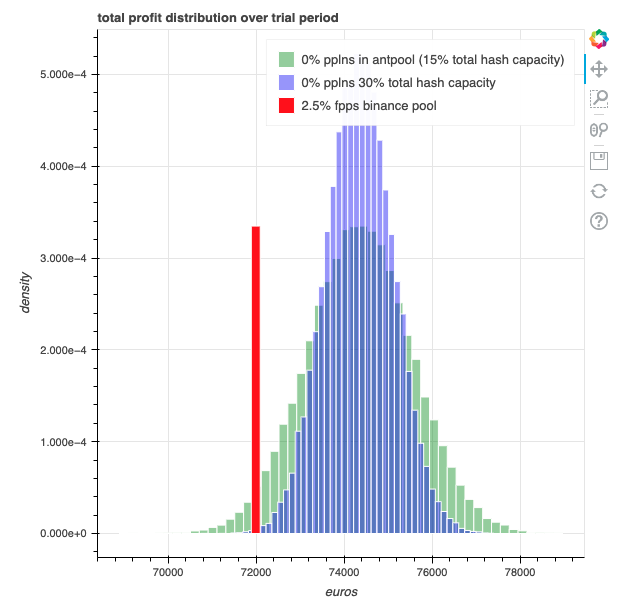
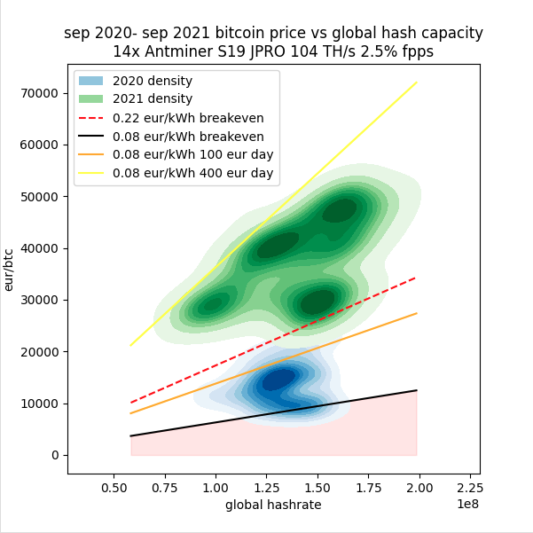
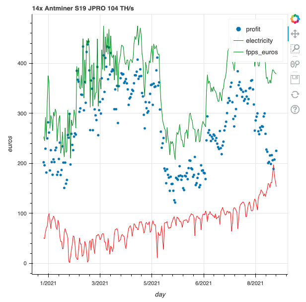

## Overview

A few quick and dirty calculations about bitcoin mining profitability; a friend was playing around with bitcoin mining and asked me about this, I was curious so I downloaded some data and played around with it. **WARNING** I'm lazy so I committed a large bitcoin data dump, fyi if you want to clone this.

Being a sunday quant was fun but it might get boring, I guess their 7-figure salaries help.

* [Conclusions](#conclusions)
  * [FPPS vs. PPLNS](#fpps_pplns)
  * [Indifference curves relating BTC price to electricity cost](#indifference_curves)
* [Usage](#usage)

## Conclusions

I got a distinctly skeevy, gold rush vibe when looking for data, not a fan of the whole bitcoin ecosystem. I'd avoid this space entirely; as the saying goes, if you're at a poker game and you don't know who the sucker is, get up and leave because it's *you*. Selling mining hardware & services looks like selling shovels during the gold rush to me.

That being said, there are 2 things I found mildly interesting:

### FPPS vs. PPLNS

Work in [./past_performance.ipynb](past_performance.ipynb)

Mining pools reward miners using a [variety of reward contracts](https://www.nicehash.com/blog/post/how-mining-pools-distribute-rewards-pps-vs-fpps-vs-pplns), I examined

* FPPS, full pay-per-share, a 0-risk system where the pool pays for each work share according to the *expected* reward & transaction fees and takes a percentage cut
* PPLNS, pay-per-last-N-shares, a system where **if a block is mined** the reward & transaction fees are divided among the miners according to work contributed to the pool over a time window (larger than a block to penalize pool hopping).

There's a tradeoff between risk and reward here, as 0 % fee pplns pools exist. So I ran a few simulations with past data to understand the magnitude of that risk-reward tradeoff, as the risk depends on the pplns pool's global hashrate share:

### Indifference curves relating BTC price to electricity cost

Work in [./mining_feasibility.ipynb](mining_feasibility.ipynb)

Unsurprisingly, bitcoin mining is extremely sensitive to electricity pricing, and indifference curves can be plotted to understand the relationship between bitcoin price, hashrate and electricity prices:

Mining revenue is extremely volatile recently given rising energy costs in europe:

## Usage

On linux or mac:

1. Create a vitualenv: `python3 -m venv env`
2. install deps: `env/bin/pip install -r requirements.txt`
3. launch notebook: `env/bin/jupyter notebook`
